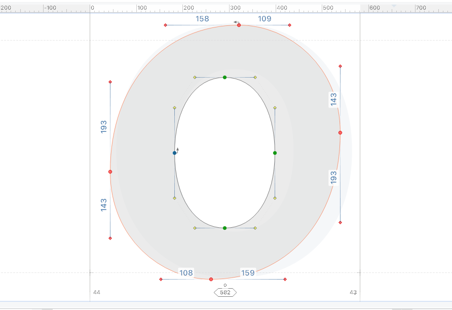

# Fontlab-python-scripts
Python scripts for Fontlab 7 and 8.

---

## Projective Transform

사각형 글리프 공간의 변의 길이를 조정하여 글리프를 원근 변환합니다.

Transform glyphs by adjusting the length of the sides of a rectangular glyph space.

---

## Generate Hangeul Composition 
Hangeul composition code forked from Hangulpy

https://github.com/rhobot/Hangulpy

선택된 자소를 조합해 한글 문자열을 생성합니다.

Generate Hangeul composition with selected graphemes.

---

## Colorize Glyphs 

선택한 글리프들에 컬러 플래그를 일괄 적용합니다. 

Batch apply color flags to selected glyphs.

---

## Toolbox Utilities

컨투어 툴의 툴박스에 액션을 추가합니다.

Add actions to the Contour Tool's toolbox.  
 

### Set X Distance (Shift + x)

Before|After
---|---
|

선택한 중복 노드 사이의 X축 방향 거리를 설정합니다.

Set the x-axis distance between the selected duplicate nodes.
 

### Set Y Distance (Shift + y)

Before|After
---|---
|

선택한 중복 노드 사이의 Y축 방향 거리를 설정합니다.

Set the y-axis distance between the selected duplicate nodes.
 

###  Duplicate Nodes (Ctrl + Alt + x)

Before|After
---|---
|

선택한 노드를 복제합니다.

Duplicate selected nodes.
 

###  Select Entire Contour (Shift + `)

Before|After
---|---
|

선택한 노드 또는 핸들이 속한 전체 컨투어를 선택합니다.

Select Entire Contour to Which Selected Nodes or Handles Belong.
 

###  Form Symmetrical Circle (Shift + o)

Before|After
---|---
|

노드를 복사하고 뒤집어 붙여넣어 대칭 원을 만듭니다.

Copy, Flip, Paste Nodes to Form a Symmetrical Circle.  